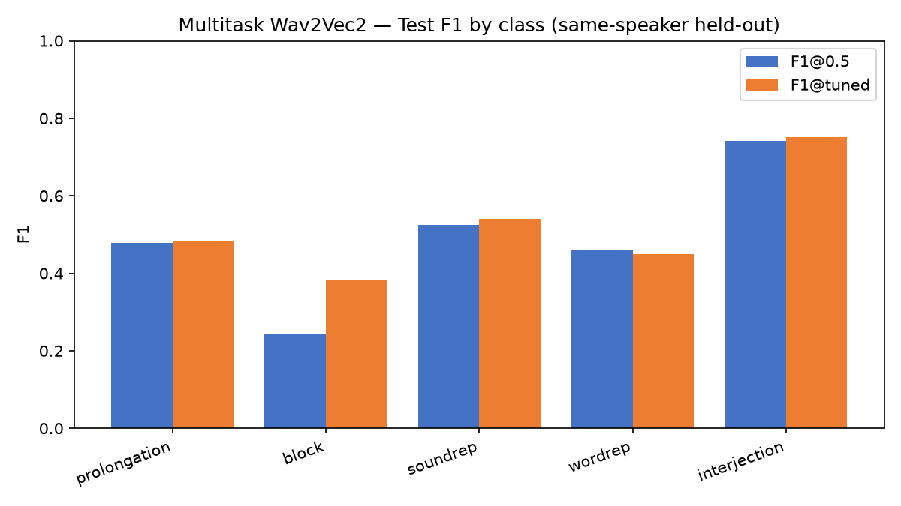
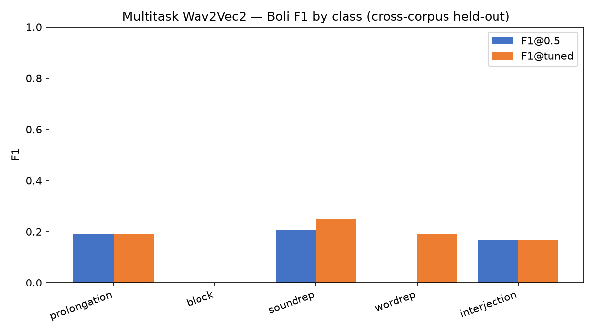
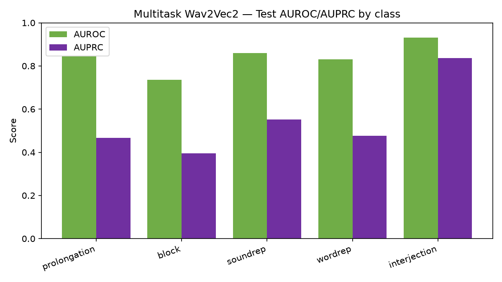
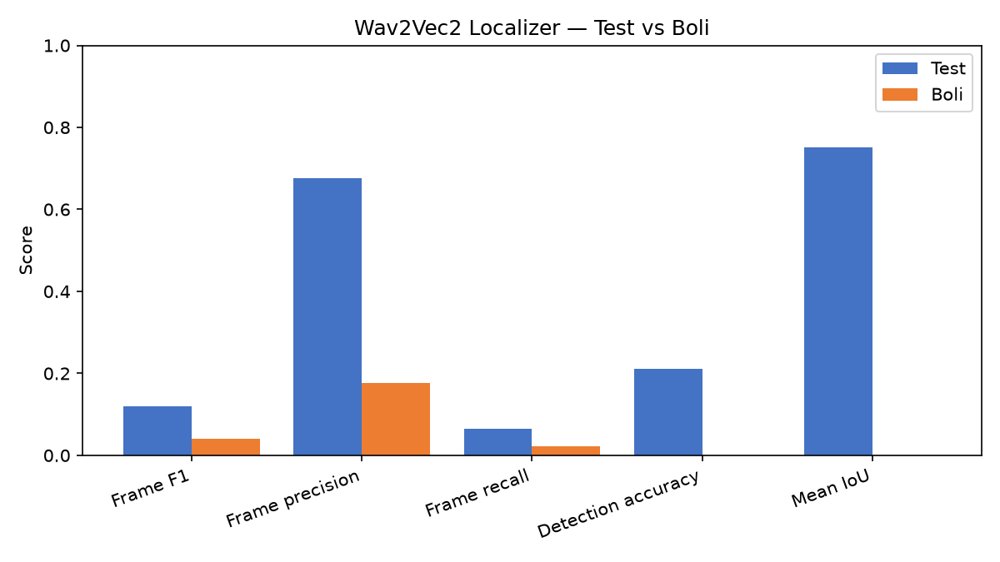

# Swaraaha — Selected Model Presentation

Selected models (best-performing):
- **Classification:** Wav2Vec2 shared backbone + 5 heads (multitask), frozen backbone 3 layers, 3 s clips.
- **Localization:** Wav2Vec2-based event localizer, 3 s clips.

Protocol: thresholds tuned on internal val only (seed 42); test = in-distribution held-out (same-speaker overlap); Boli = cross-corpus held-out.

## Classification — per-class F1 (multitask Wav2Vec2)

| Class | Test F1@0.5 | Test F1@tuned | Test AUROC | Test AUPRC | Boli F1@0.5 | Boli F1@tuned |
|---|---|---|---|---|---|---|
| prolongation | 0.478 | 0.483 | 0.844 | 0.467 | 0.191 | 0.191 |
| block | 0.243 | 0.383 | 0.735 | 0.395 | 0.000 | 0.000 |
| soundrep | 0.524 | 0.541 | 0.860 | 0.552 | 0.205 | 0.250 |
| wordrep | 0.461 | 0.449 | 0.830 | 0.477 | 0.000 | 0.191 |
| interjection | 0.741 | 0.751 | 0.931 | 0.836 | 0.167 | 0.167 |

**Macro F1:** test @0.5 = 0.4896, test @tuned = 0.5215, Boli @0.5 = 0.1125, Boli @tuned = 0.1595

## Localization — Wav2Vec2 localizer

| Metric | Test | Boli |
|---|---|---|
| Frame F1 | 0.119 | 0.040 |
| Frame precision | 0.676 | 0.177 |
| Frame recall | 0.065 | 0.023 |
| Detection accuracy | 0.210 | 0.000 |
| Mean IoU | 0.751 | 0.000 |
| False alarms/min | 8.95 | 11.16 |

## Caveats

- Test set has known same-speaker overlap (in-distribution held-out is optimistic).
- Boli is the only cross-corpus held-out set (53 clips) — numbers are noisy but honest.
- Single seed 42; thresholds tuned on val only, no test or Boli threshold fitting.
